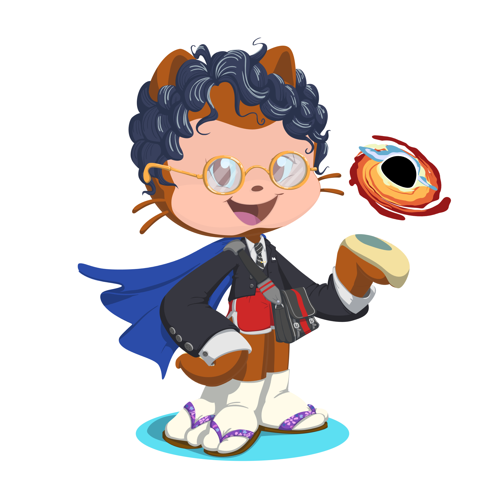

<h1 align="center">About Me</h1>

📝 I'm in my first year studying software engineering at 42 school

📚 At 42, intensive use of C allowed me to develop a strong foundation in programming logic, data structures, and algorithms, while teamwork and peer-to-peer methodology honed my communication and collaboration skills.

💻 I am developing my skills as a Back-End Developer | Enthuastic about new technologies

⚡ Fun fact: I 💖 to code 24x7.

 
 
 

<!-- DIV CONNECT -->
<h1 align="center">Connect With My</h1>

    

        
            
    

<!-- DIV SKILLs -->
<h1 align="center">My Skills</h1>

    

        <h3 align="center">Languages</h3>
        
        
        
        
        <!--  -->
        <!--  -->
        
        
        <h3 align="center">Technologies and Tools</h3>
        
        
        
    

<!-- DIV 42 SCHOOL -->

    <h1>My Projects From 42 School</h1>
    <h3>Start</h3>
    
    <h3>Rank 0</h3>
    
    <h3>Rank 1</h3>
    
    
    
    <h3>Rank 2</h3>
    
    
    
    

<!-- DIV GIT STATICS -->

    <h1>GitHub Statics</h1>

    <!-- 
     
     
     -->

